# hmall - A Java backend online shopping mall project

[![MIT][License-Image]][License-Url] [](https://github.com/alwitt/livemix/actions/workflows/cicd.yaml)

[License-Url]: https://mit-license.org/
[License-Image]: https://img.shields.io/badge/License-MIT-blue.svg

`Hmall` is a Java backend online shopping mall project based on microservice architecture. The main technology stack includes Spring Cloud, Redis, Elasticsearch, RocketMQ, and others. This e-commerce system utilises a distributed architecture to provide a scalable and efficient platform for online retail operations.

# Key Features

- The project leverages Spring Cloud to build and manage microservices.
- Use Redis for caching and session management.
- Implement Elasticsearch for powerful search capabilities,
- RocketMQ for message queuing and asynchronous communication between services.

This combination of technologies enables the system to handle high concurrency, provide fast and accurate search results, and maintain data consistency across various components of the e-commerce platform.

# Overview

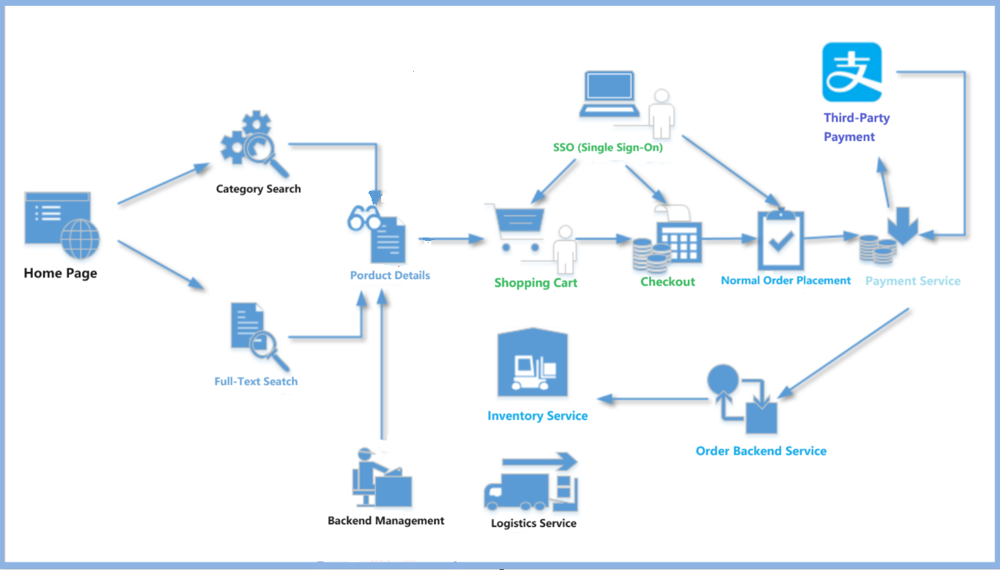

## Code Structure

- hmall is the parent project for all other Maven projects, containing no code and centrally managing the versions of third-party open-source frameworks used in our project.
- hmall-common

The parent project of the common project, managing dependencies for the following common projects

```xml
<modules>
    <module>common-util</module>
    <module>common-service</module>
    <module>common-mq</module>
</modules>
```

- hmall-gateway: Based on Spring Cloud Gateway
- hmall-product, hmall-order, hmall-user, hmall-xxx:
  - Each represents a service
  - xxx-api: Public request and response entity classes exposed by the service
  - xxx-service: The actual service implementation code
  - xxx-service always depends on xxx-api
- common-service
  - Manages some dependencies that xxx-service services might use
- common-mq: Common message module

# Preparation Work

## Port Mapping

Containers inherently possess isolation characteristics, so different containers have independent network systems. As a result, two different containers can fully utilise the same ports internally and can use ports already in use on the host machine. These identical port numbers are unrelated and cannot communicate with each other over the network.

If you want to provide services externally through containers, you need to establish a mapping between the container's ports and the host machine's ports.

Port mapping can be achieved using the -p option with docker run;

```bash
#Map the host machine's port 8080 to the container's port 80
#-p: Specify port mapping, format: host port:container port
docker run -d -p 8080:80 nginx
```

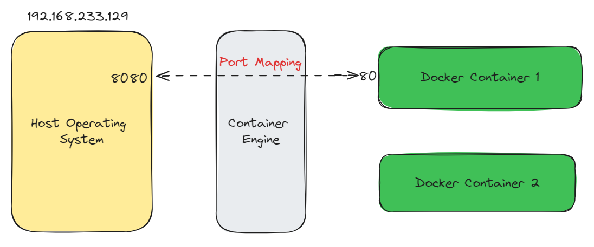

## File Mapping

Containers inherently possess isolation characteristics, so different containers have independent file systems. Any modifications made inside a container will not affect the host machine or other containers. If a container is deleted, all data within it ceases to exit.

Therefore, if you want to access the data from a container even after it has been deleted(for example, data in a database), you need to map a specific directory inside the container to the host machine's file system.

This allows the data to be saved on the host machine, so that even if the container is deleted, we can still access the container's previous data on the host machine.

Data persistence can be achieved using the -v option with docker run;

```bash
docker run -d -p 8081:80 -v /tmp/text:/usrs/share/nginx/html nginx
```

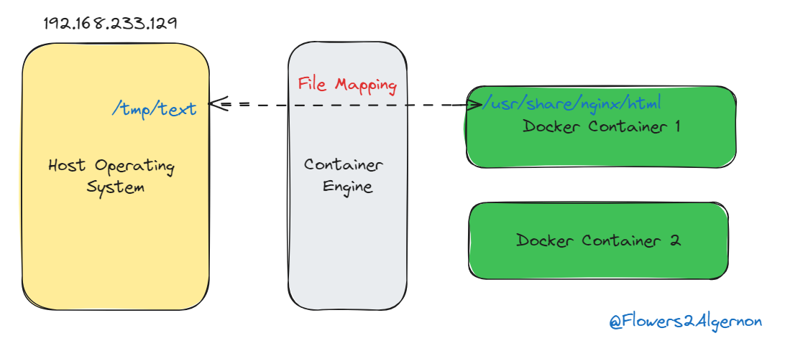

## Docker containers

The following containers will start

```
$ docker ps
CONTAINER ID          IMAGE                            COMMAND            CREATED        STATUS                PORTS                NAMES
7ba1e06bcc72   rocketmqinc/rocketmq             "sh mqbroker -c /opt…"   4 days ago    Up About a minute   0.0.0.0:10909->10909/tcp, :::10909->10909/tcp, 9876/tcp, 0.0.0.0:10911->10911/tcp, :::10911->10911/tcp   rmqbroker
bf5324e09975   rocketmqinc/rocketmq             "sh mqnamesrv"           4 days ago    Up About a minute   10909/tcp, 0.0.0.0:9876->9876/tcp, :::9876->9876/tcp, 10911/tcp                                          rmqnamesrv
1b5b43941a37   kibana:7.8.0                     "/usr/local/bin/dumb…"   11 days ago   Up About a minute   0.0.0.0:5601->5601/tcp, :::5601->5601/tcp                                                                kibana
cd6fab6f72ef   elasticsearch:7.8.0              "/tini -- /usr/local…"   11 days ago   Up About a minute   0.0.0.0:9200->9200/tcp, :::9200->9200/tcp, 0.0.0.0:9300->9300/tcp, :::9300->9300/tcp                     elasticsearch
5954b873d79a   minio/minio                      "/usr/bin/docker-ent…"   2 weeks ago   Up About a minute   0.0.0.0:9000-9001->9000-9001/tcp, :::9000-9001->9000-9001/tcp                                            minio
48b909b35ccd   nacos/nacos-server:v2.2.0-slim   "bin/docker-startup.…"   2 weeks ago   Up About a minute   0.0.0.0:8848->8848/tcp, :::8848->8848/tcp, 0.0.0.0:9848->9848/tcp, :::9848->9848/tcp                     nacos
29035242989a   redis:6.2                        "docker-entrypoint.s…"   2 weeks ago   Up About a minute   0.0.0.0:6379->6379/tcp, :::6379->6379/tcp                                                                redis-server
1ca103e80a2f   mysql                            "docker-entrypoint.s…"   2 weeks ago   Up About a minute   0.0.0.0:3306->3306/tcp, :::3306->3306/tcp, 33060/tcp                                                     mysql

```

## Redisson

To use Redisson, we first need to import the dependency, and then we can start using Redisson.

```xml
    <dependencies>
        <dependency>
                <groupId>org.redisson</groupId>
                <artifactId>redisson</artifactId>
                <version>3.11.1</version>
        </dependency>
    </dependencies>
```

Example: before accessing Redis with Redisson, we need to construct a RedissonClient object.

```java
        // 1. Create a new config object
        Config config = new Config();
        // 2. Configure the Config object
        SingleServerConfig serverConfig = config.useSingleServer()
                // Set the address to access Redis here
                .setAddress("redis://localhost:6379");

        // Set the serialization method, using Jackson for serialization and deserialization
        config.setCodec(new JsonJacksonCodec());

        // 3. Create a Redis client. This object will initiate a connection request to the Redis server when created
        RedissonClient redissonClient = Redisson.create(config);
```

It's important to note that when created, the RedissonClient object will initiate a connection request to the Redis Server. So if the connection to the Redis Server fails, the RedissonClient object will also fail to create!

After creating the RedissonClient object, we can access the five basic data types in Redis.

# Spring Cloud

## Monolithic applications

In the early stages of monolithic applications, when applications were relatively small, the benefits of monolithic architecture included:

- Simple application development.
- It is easy to make large-scale changes to the application.
- Testing is relatively straightforward.
- Deployment is clear and simple.
- Horizontal scaling is effortless.

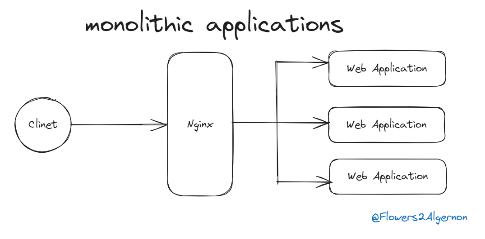

However, as time passes and the monolithic application includes more and more functions, with the application's `size` growing larger, the drawbacks of monolithic applications gradually become apparent:

- Code becomes excessively complex and severely coupled, making it difficult ot maintain.
- The cycle from code submission to actual deployment is very long.
- Slow development and slow startup seriously affect development efficiency.
- Difficult to deliver reliable monolithic applications.

## Microservice architecture

What is microservice architecture? It's an architecture style that decomposes application functionality into a set of services.

Modularity is the foundation for developing large, complex applications. When a monolithic application becomes too large, it's difficult to develop as a whole and hard for one person to understand fully. Large applications need to be broken down into modules to enable different people to develop and understand(different parts).

- In monolithic architecture, modules are typically defined by a set of structures provided by the programming language (for example, packages in Java or jar files). However, with modules obtained this way, code from different modules can still reference each other, leading to chaotic object dependencies between modules.
- Microservice architecture uses microservices as the unit of modularity. To access a service, you can only use the API provided by the service externally. Thus, the service's API builds an insurmountable boundary for itself, and you cannot bypass the API to access the internal classes of the service. Using microservice architecture can solve the pain points of large monolithic applications.

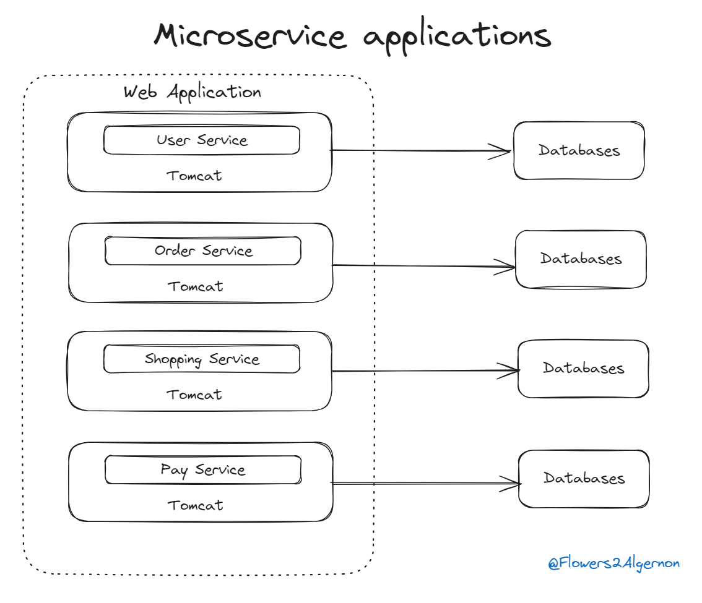

## Use Spring Cloud in this project

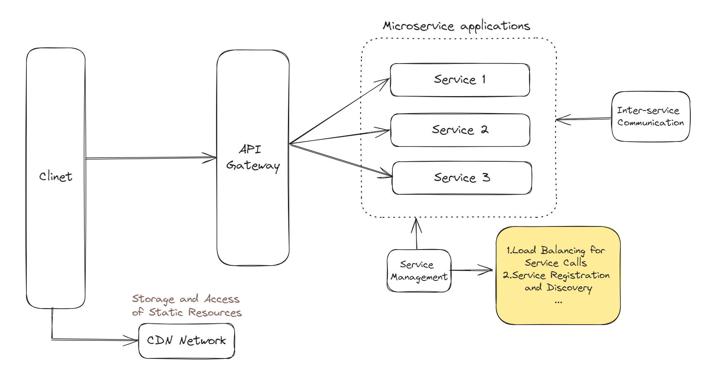

# Nacos

## Service manage

If the service consumer doesn't specify the service provider's address when it's defined, how does the service consumer know where to call the service provider?

At this point, we need to introduce a new role - the service registry center, which uniformly manages the status and information of services, thus solving this problem.

For each service:

- When the service starts, it will register its own information to the service registry center, including IP address, port number, and other information. This achieves service registration.
- During the service operation, it will constantly "report" its status to the service registry center so that the service registry center can perceive the operating status of the service in real time.
- At the same time, when the service starts, it will also pull information about other services from the registry center, that is, download the service registry information locally. This way, a service can know other services' calling addresses and other information.
- During the service operation, the service will constantly pull the latest service registry information from the registry center, thus achieving real-time service discovery.

In this project, we mainly use Nacos to manage service.

Nacos primarily adopts a Client-Server(C-S) architecture for implementation:

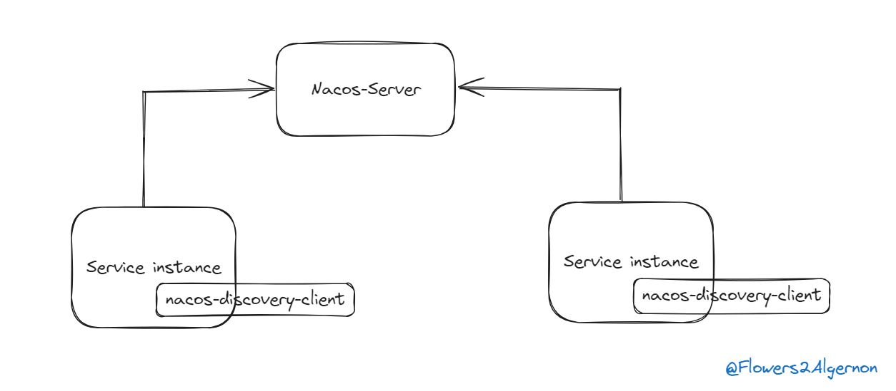

- NacosServer implements the functionality of a registry center and can run independently.
- NacosDiscoveryClient is responsible for helping service instances access NacosServer, implementing service registration and automatic discovery.

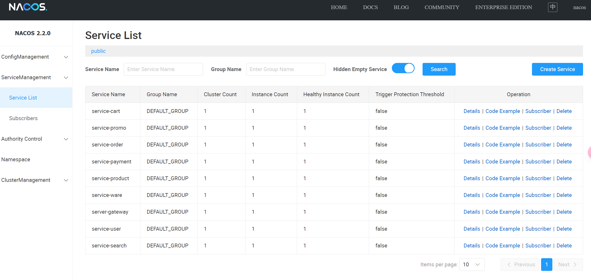

## Configuration manage

Imagine if each service had its own configuration, such as the database address it accesses. But one day, the server address where the database is deployed changes. What would happen then? To ensure services can correctly access the database, we would have to stop each service, modify the configuration file of each service, and then restart each service. Two problems would arise in this process:

- Modifying configuration files is tedious and time-consuming, especially when there are numerous services.
- To make the new configuration effective, services need to be restarted.

To solve the above problems, we need to introduce a new role in our microservice architecture project - the configuration center. Similar to the registry center, there are multiple implementations of the configuration center, and Nacos also implements the role of a configuration center.

Nacos provides multiple dimensions to help us distinguish different configurations. Their relationship is shown in the following diagram:

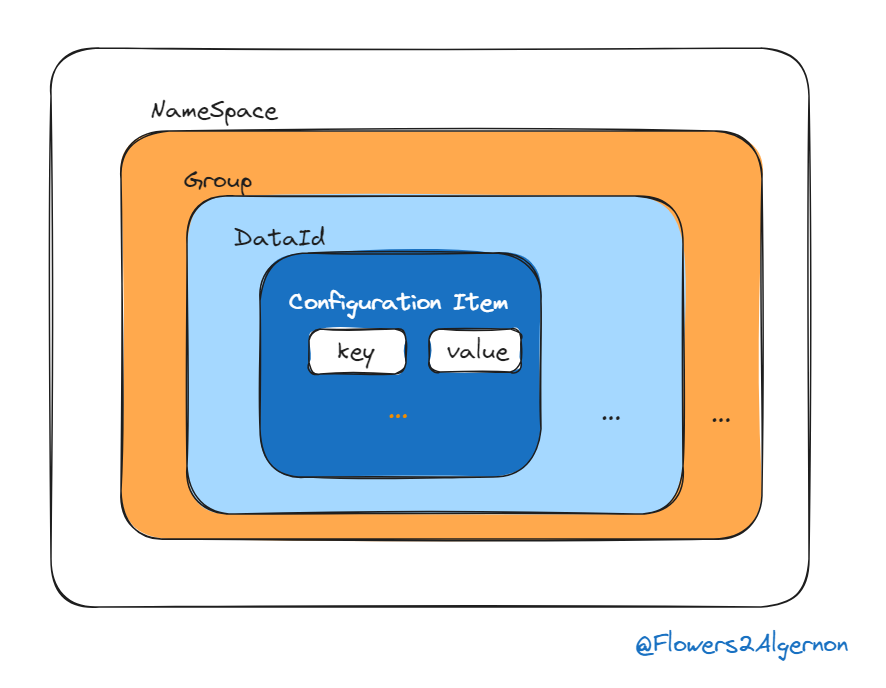

Actual management:

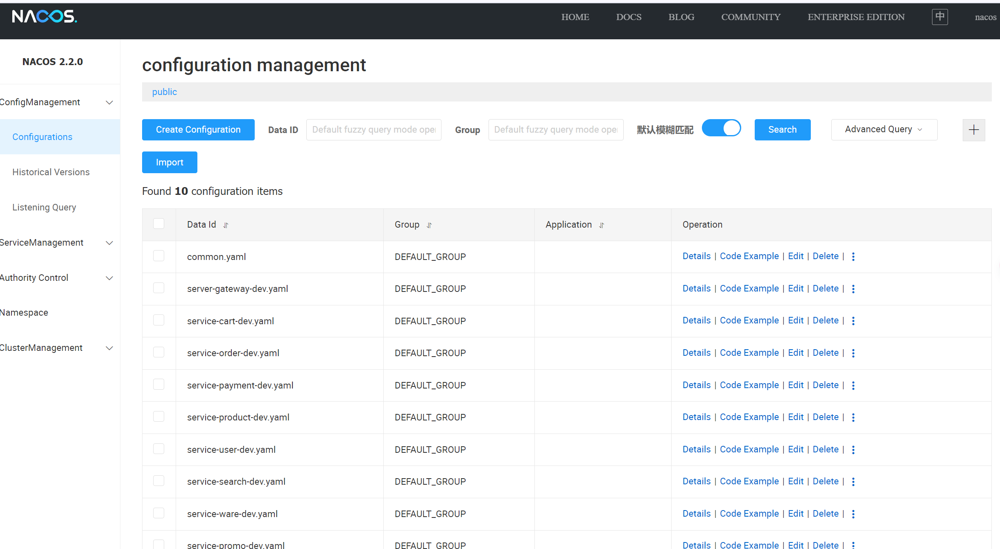

# Gateway

In this project, the API gateway is a server that serves as the sole entry point to the system.
The core principle of the API gateway approach is that all clients and consumers access microservices through a unified gateway, where all non-business functions are handled at the gateway layer. Typically, the gateway provides REST/HTTP access APIs.

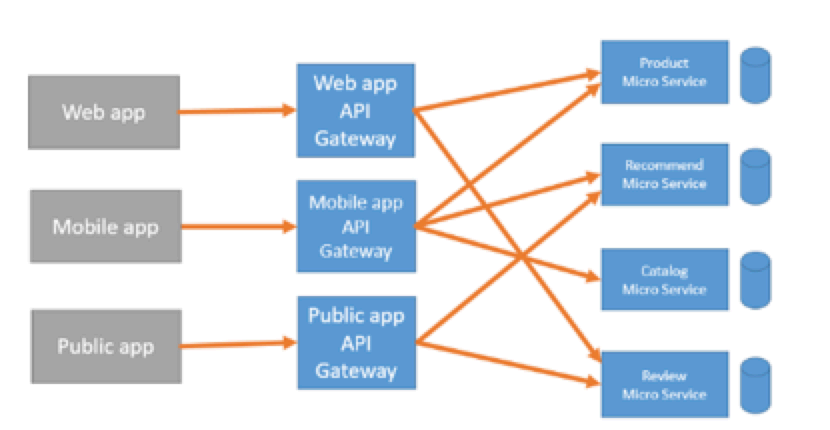
